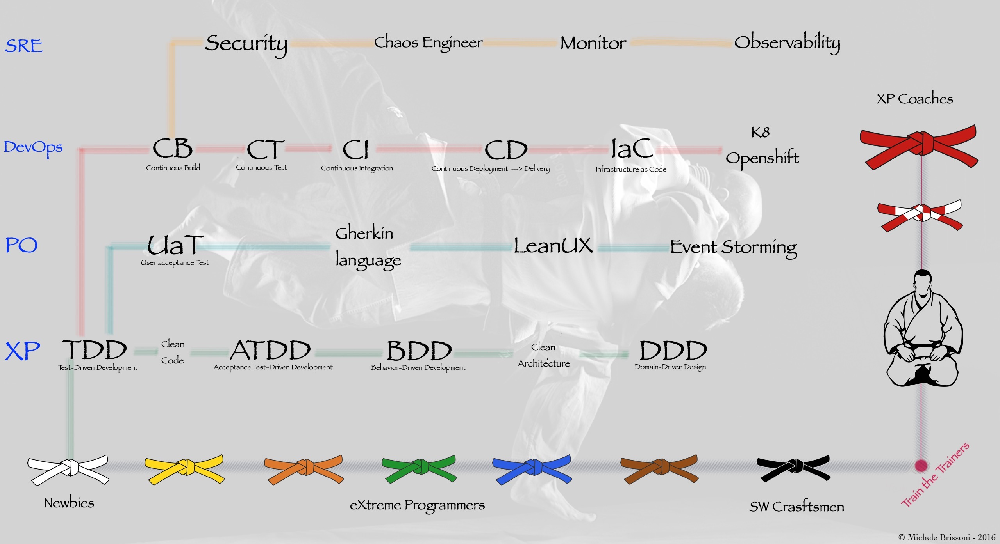

# SW Craftsmanship Dojo® 🥋 - Open source version

## What is the "SW Craftsmanship Dojo®"? 🚀

The "SW Craftsmanship Dojo®" 🥋 is far from a typical training program; it's a
transformative journey that enriches century-old martial arts teaching
traditions with the power of continuous learning, neuroscience, and behavioral
psychology. This unique platform propels individuals and organizations towards
software craftsmanship and elite performances. It revolutionizes how we approach
software development, cultivating a culture of performance. It offers a comprehensive
journey, spanning from product discovery and development to production-ready Site
Reliability Engineering (SRE) practices.

## When Was it Created? 📅

The SW Craftsmanship Dojo® 🥋 started as a coaching experiment in early 2000,
and it became something tangible in the summer 2010 from
over a decade of empirical studies. In the period 2010-2015 thanks to extensive industry
research, and the best emerging DevOps practices of the software development realm, it
evolved to its mature version.
Its creation stands as a testament to the unwavering dedication I put in the project.

## Why Was it Created? 💡

The SW Craftsmanship Dojo® 🥋 emerged to meet the pressing need for a
transformative learning experience within the ever-evolving software development
landscape. Its mission is to bridge the gap between theory and practice,
offering a comprehensive approach that enables continuous skill and knowledge
evolution. It empowers developers on a journey towards mastery, aligning and going beyond the [SW Craftsmanship manifesto](https://manifesto.softwarecraftsmanship.org/).
It equips individuals with the tools to navigate the intricate world of modern
software development, leveraging renowned frameworks such as DORA & Accelerate,
Better Value Sooner Safer Happier (BVSSH), Team Topologies, The Flow, and
LeanUX. This initiative starts with the recognition that nearly 95% of
developers operate within dysfunctional Agile teams (with a capital 'A'),
struggling with poor product management and suboptimal SW delivery practices.
The SW Craftsmanship Dojo 🥋 wants to bring back pride and fun in the SW
development landscape.

## How Does it Work? 🔧

The SW Craftsmanship Dojo® 🥋 belt system, drawing inspiration from the
discipline of Judo 🥋, symbolizes your progress, from novice (white belt) to
expert (black belt). Much like in Judo, it represents not only your skill level
but also your commitment to the craft and the community. Your journey through
the belt system mirrors your growth in software craftsmanship. The dojo operates
on the principle of continuous practice, with a unique curriculum meticulously
designed to harness the power of daily incremental growth. By improving yourself
by just 1% each day, you'll be astounded by the exponential advancements within
your grasp. The program encompasses theory, practice, coaching, mentoring, and a
vibrant community of practitioners, all grounded in neuroscience and behavioral
psychology techniques.

## Why is it Different? 🌟

What truly sets the SW Craftsmanship Dojo® 🥋 apart is its holistic approach.
It's not merely about attending classes; it's about immediately applying what
you learn in your day-to-day work. Additionally, its unique approach
incorporates neuroscience components, leveraging gamification and role-play
games, which have demonstrated astonishing results in correcting dysfunctional
behaviors. We use tactical empathy to expose the reasons why the majority of
software lifecycles are dysfunctional and painful. The program provides the
awareness and tools to address these issues, bringing back the pride in your
work and the passion that will propel you and your projects toward elite
performance.

## Open Source Version - Disclaimer ❗️

However, it's important to note that the full potential of the SW Craftsmanship
Dojo® 🥋 isn't solely in the curriculum (here present only in the white, and yellow belts).
Having skilled coaches who play the role of sensei and guide you on your journey is a
crucial element in unlocking the dojo's transformative power.

---

## Belts & Curriculum

The curriculum of the SW Craftsmanship Dojo® 🥋 was initially designed around a
full immersion bootcamp with the initial spark of the dojo. The experiment used the
["Library Starway to Orion"](https://github.com/xpeppers/starway-to-orione) made
by my XPepper friends, and a 6 months of a Samman coach embedded in the team.
Afterward, with an iterative approach of hypothesis and experiments, the program
was sliced into smaller increments (belts) and in the actual format of a continuous learning dojo. The belts are the milestones for SW craftsmanship:

Through this structured curriculum, the SW Craftsmanship Dojo 🥋 empowers you to
not only become a master of software craftsmanship but also align your skills
with real-world industry demands, ensuring you're well-prepared to create
exceptional software products.

---

## Where to start

Start your SW Craftsmanship journey by clicking ["👉 HERE 👈"](belts/README.md).
