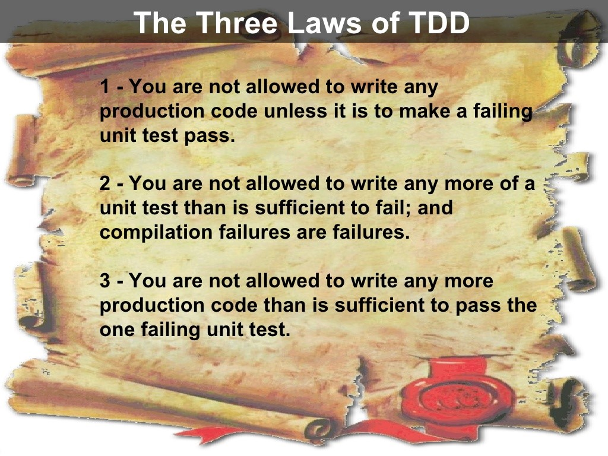

# ⚪️ White Belt ⚪️ Lesson 2: 3 LAWS of TDD

Note: If the class is too shy, swap lessons 2 and 3 to hack the mood with the
rally video

## 👨🏻‍🏫 Recap

- 🤔 Why TDD? --> Let the team reply

## 📚 Homework showcase

- Daily kata awareness moment --> showcase
- 🙋‍♂️ Have you measured your focus? how many 🍅/day?

## 📖 Theory behind focus

- 📑 Researches about focus:
  - 46% of the time, we're out of focus doing something [2010] GILBERT &
    KILLINGSWORTH
- 😱 Why ⁉️
  - 📕
    [Training from the back of the room](https://learning.oreilly.com/library/view/training-from-the/9780787996628/)
  - 🧠 Mirron Neuron:
    - [The Mirror-neuron system](https://www.annualreviews.org/doi/10.1146/annurev.neuro.27.070203.144230)
      Prof. Rizzolati (2004)
    - [Mirror Neuron - From 🐒 monkey to 🏃‍♂️ human](https://www.youtube.com/watch?v=yKPTuCoop8c&ab_channel=gocognitive)

## 🍅 Pomodoro Technique & effective time management

- Why are 25 minutes of focus effective?
  - Nirvana:
    [In the flow or in the zone](https://www.youtube.com/watch?v=iUsOCR1KKms&ab_channel=JohnSpencer)
  - [Daily plan chopped into 25 mins of in the flow](https://francescocirillo.com/products/the-pomodoro-technique-book-us-edition):
    the social balance to being connected and in the flow.
  - Why being focused is essential
    [The cost of multitasking](https://www.apa.org/topics/research/multitasking)
    😲

## 🏋️ Practice: How do I plan an effective pomodoro? _CHALLENGE TIME_

- Install: Visual Studio Code + Install: live share plugin
- Git init + project init: < 1 min.
- TDD framework installation (jest, JUnit, pytest, RSpec, etc.)
- Code strictly adhering to the 3 TDD laws 

---

## 📚 Homework

1. 🎥🍿
   [Mirror Neuron - From monkey to human](https://www.youtube.com/watch?v=yKPTuCoop8c&ab_channel=gocognitive)
2. 📖 Start reading
   [Training from the back of the room](https://learning.oreilly.com/library/view/training-from-the/9780787996628/)
3. Do 5+ katas in the week
