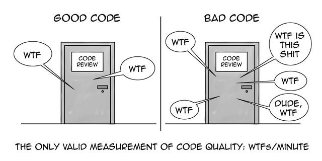

# ⚪️ White Belt ⚪️ Lesson 4: Consolidate Notes & strict TDD

## 📚 Homework showcase

- Daily kata awareness moment --> showcase
- 🙋‍♂️ Did you complete a kata a day?
- 🙋‍♂️ Did you `book a focus time` in your daily schedule?

## 👨🏻‍🏫 Recap

- 🤔 What do you think about Pair Programming?
- 🤔 What is the takeaway from your homework to create effective notes?

## 🏋️ Practice: Pair programming with a KATA

- Step 1️⃣:
  - ⏱️ 5 minutes
  - 📝 create your notes
- Step 2️⃣:
  - ⏱️ 20 minutes:
  - 👨‍💻 Code in strict TDD one test at a time
  - 📝 Use your notes properly
  - 🔴 RED >> Write ONE failing Test
  - 🟢 GREEN >> Write the code to make it pass (NOT MORE!)
  - ♻️ REFACTOR >> clean the code to 'well-written-prose'
- Step 3️⃣:
  - 🍅 REGROUP after 25 minutes
  - 🗣️ Let's review ---> the gamification of the WTF measurement

## 📚 Homework

1. 5+ katas with notes.
2. Improve your daily drill:
   - Only 1 🍅 Pomodoro
   - Commit at every 🔴Red/🟢Green/♻️Refactor
   - Use the 📝 properly
   - Read your code 📖 and measure how many WTF moments you're gonna enjoy 😲
