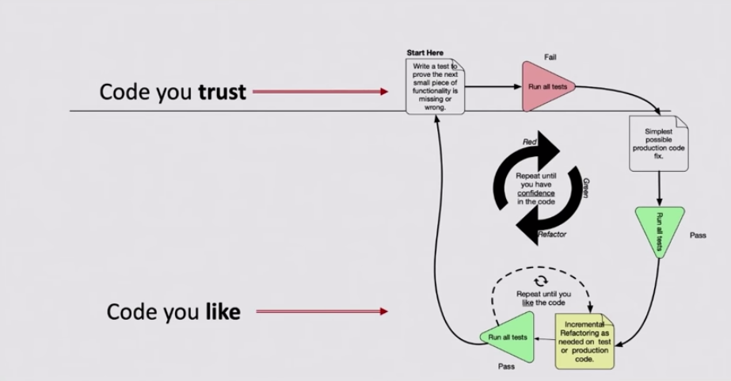

# ⚪️ White Belt ⚪️ Lesson 5: Strict TDD & Refactor (read like a well-written-prose)

## 📚 Homework showcase

- Daily kata awareness moment --> showcase
- 🙋‍♂️ Did you complete a kata a day?
- 🙋‍♂️ How many WTF moments did you measure?

## 👨🏻‍🏫 Recap

- 🙋‍♂️ What do you think about the WTF measurement?
- 🙋‍♂️ What is the outcome of refactoring?

## 📚 Theory via RPG: A PO explains a product

- User stories:
  - 🗑️ dysfunctional
  - 💍 INVEST
  - 🔪 small batches

## 🏋️ Practice: We have a product

- Kata: code in MOB
  - Do one small user story at a time (🔴 >> 🟢)
  - DoD: ♻️ refactor VS it's 🟢
- 🎯 desired outcomes:
  - The kata description is implemented into the test suite
  - Normalize the code with the test and the domain glossary
  - Read the code, as it's a well-written prose
  - The art of refactoring == SMALL INCREMENTS
    
  - 👍 YOU END IT WHEN YOU LIKE READING YOUR CODE AS IT'S A BOOK!
  - 👎 Ops our code mutated behaviors 😱

## 📚 Homework

1. 5+ katas with notes.
2. Improve your daily drill:
   - Only 1 🍅 Pomodoro
   - Commit at every 🔴Red/🟢Green/♻️Refactor
   - Use the 📝 properly
   - Read your code 📖 and measure how many WTF moments you're gonna enjoy 😲
   - Rate your code as it's a best-seller book... 5⭐️ or 🗑️?
