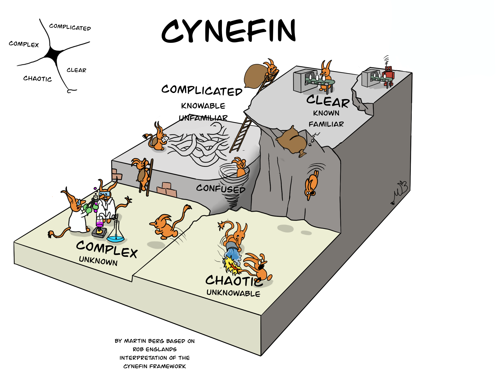

# ⚪️ White Belt ⚪️ Lesson 10: Refactor from the DDD Test suite to read it as a book

## 📚 Homework showcase

- Daily kata awareness moment --> showcase
- 🙋‍♂️ Did you complete a kata a day?
- 🙋‍♂️ Do you find it challenging to create an incremental test approach?

## 👨🏻‍🏫 Recap

- 🤔 Why should we create the code incrementally?

## 📚 Theory: Cynefin Framework

- Complexity affects your testability
  - 👍 Clear: You know, you can test easily --> Automate
  - 🤔 Complicated: You know, you figure out how to test --> Clear
  - 🧪 Complex: You don't know, you need spikes to understand --> Complicated
  - 😱 Chaotic: Nobody knows; we need some hypotheses --> Complex

- 🫣 The pitfall of 'yeah, I know' --> the fall from CLEAR to CHOAS!

## 🏋️ Practice: Solve a new kata like a scientist

- KATA:
  - New simple kata with linear complexity
    - Backlog: incremental US with UAT
    - Kata Scaffolding: git init + test dependencies + dummy tests + watcher
      loop
    - 👩🏻‍💻 Let's incrementally code (🔴Red/🟢Green/♻️Refactor):
      - 🧪 Unit test loop: atomic behaviors + Guardians
      - 🧩 Component & 🔌 Integration test loop: join atomic behaviors
      - 🤝 E2E test loop: simulate the user
    - 🤔 Look at your code. Is it more clean than before?
  - 👀 Observations:
    - Coding efficiency:
      - Mouse VS shortcut
      - Typing VS snippets
    - Kata Scaffolding:
      - 🤔 Have you sped it up? Have you built a Kata Jumpstart?

## 📚 Homework

1. 5+ katas with notes.
2. Improve your daily drill:
   - Only 1 🍅 Pomodoro
   - Improve your backlog with incremental US with simple UAT
   - Use the 📝 properly to create an incremental flow
   - Commit at every 🔴Red/🟢Green/♻️Refactor --> read your code 📖
   - Update and tame the `TECHDEBT.md`
   - Go ahead incrementally applying the `Boy Scout rule` to evolve your code
   - Complete it and rate your code as it's a best-seller book... 5⭐️ or 🗑️?
