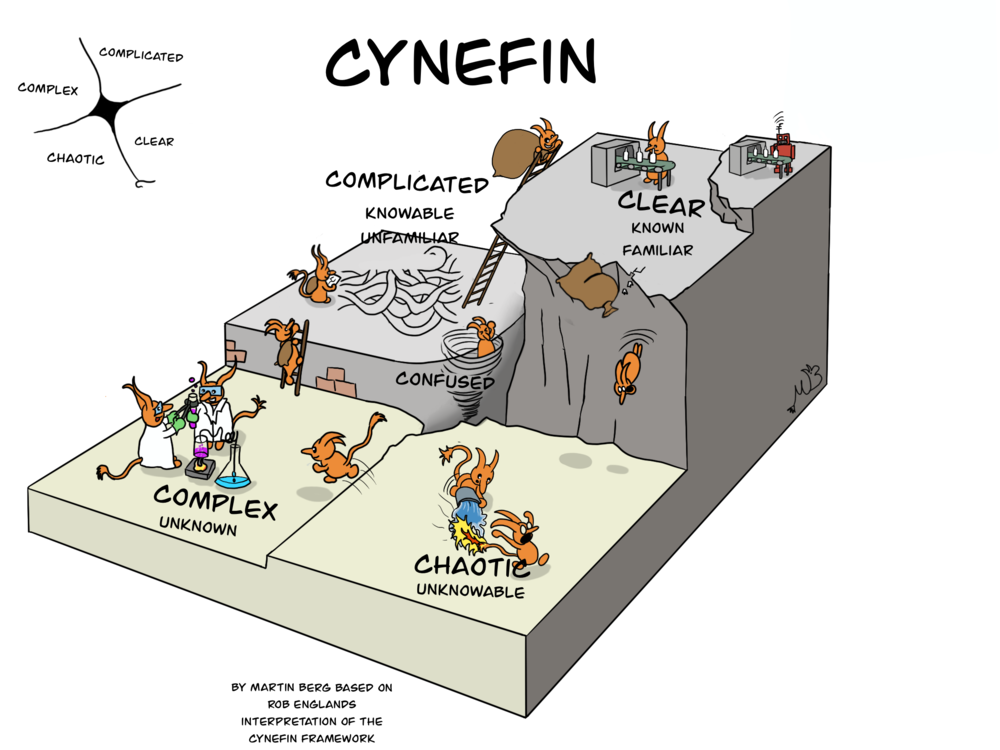

# 🟡 Yellow Belt 🟡 Lesson 1: Cynefin Framework

## 🍅 1 - 🤔 Awareness of the Pain Doing the Exam

Do you remember
[The Cynefin Framework](https://www.youtube.com/watch?v=N7oz366X0-8)?

- 🤔 Did you face the pain of moving into one of the Complicated or Complex
  realms?
- 🤔 Did you accidentally fall into the Chaotic or in the Confused realm?
- 🤔 How can you detangle the complication before creating a test?

## 🍅 2 - 📝 Sketch the Solution

- 👀 Observe the kata from a user perspective
- ✍️ Create plans about how to deal with the problem
- 😲 What is the user perspective: DDD
  - Domain-Driven Design by Eric Evans (aka the blue book)
  - Domain-Driven Design Distilled
  - Implementing Domain-Driven Design (aka the red book)
  - Domain Modelling made functional

## 🍅 3 - 🧠 Mindset Change

- 🎛️ Switch from the inside view to the outside
  - See the problem to solve
  - Do what your user does

## 🍅 4 - 📖 Vocabulary

- Create the Domain Vocabulary - plot
  - Nouns: actors
  - Verbs: actions
  - Nouns + behaviors: The board is painted
  - Verbs + Objects: Paint the X pin
  - Repeat for every time-lapse picture to have a BDD scenario described in DDD

---

## 📚 Homework

1. 5+ katas with notes.
2. Improve your daily drill:
   - Only 1 🍅 Pomodoro
   - 👉 Create the time-lapse picture and description
   - Use the 📝 properly
   - Commit at every 🔴Red/🟢Green/♻️Refactor
   - After every green scenario, write the technical debt into a file
     `TECHDEBT.md`
   - Commit code, notes, and tech debt in git at every cycle
   - Apply the refactor _Boy Scout rule_
   - Rate your code as it's a best-seller book... 5⭐️ or 🗑️?
