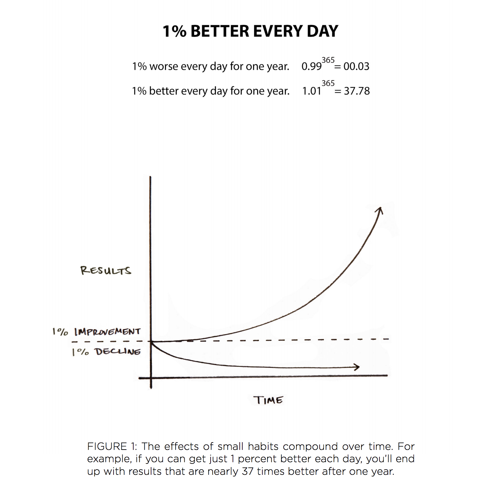
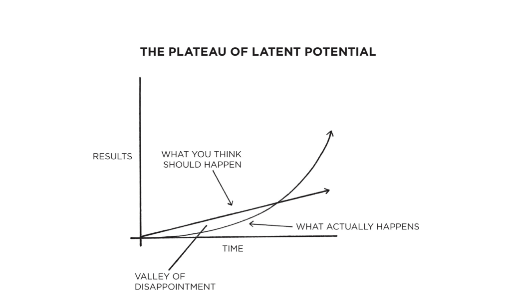

# 🟡 Yellow Belt 🟡 Lesson 4: Graduation Exercise With DDD Mini-Loop Part III

## 📚 Homework Showcase

- Daily kata awareness moment --> showcase
- 🙋‍♂️ Did you observe the problem as a user?
- 🙋‍♂️ Are your notes now full of examples?
- 🙋‍♂️ Did you use the examples to create the tests?
- 🙋‍♂️ Did the time-lapse picture help you to structure the tests into incremental
  complexity?

---

## 📚 Theory: The Concept of Technical Debt (Tech Debt)

- 👿 The over-engineer troller:
  `If you put a rotten apple in a basket of healthy apples, the whole basket will rot`
- 🧹 It's your responsibility to keep the code clean
- Why does tech debt happen?
  - We cut corners: The debt needs to be paid at some point
  - Requirements change/evolve
  - 🎥
    [7 minutes, 26 seconds, and the Fundamental Theorem of Agile Software Development](https://www.youtube.com/watch?v=WSes_PexXcA&ab_channel=jbrains762)

## 🏋🏻‍♂️ Practice: Find the Complexity

- 👀 Look at your code:
  - Where is the problem's complication (_essential complication_)?
    `The problem is complicated`
  - Where is the complexity you injected in the code (_accidental
    complication_)? `because we cut corners`
- 💰 Where is the cost of a feature?
  - 😭 in _accidental complication_ 🫢
- 👉 Tech Debt is tracking _accidental complication_

---

## 📚 Theory: Emerging Architecture

- 👿 The over-engineer troller - part II: `Developers tend to design spaceships`
  - Satisfying their technical curiosity
  - Preparing for future scenarios - **that never come**
  - Using their beloved hammer to solve all the problems - instead of the proper
    language tool
- Instead, let the requirements drive the design:
  - 🎙️ USE EXAMPLES
  - 🎙️ KEEP THEM SIMPLE
  - Refactor to reduce _accidental complications_ to ZERO!

## 🏋🏻‍♂️ Practice: Was Your Architecture Emerging?

- 👀 Look at your notes, tests, and code:
  - Was your architecture emerging?
  - Did you smash a golden design pattern to solve the problem?
  - Is the architecture driven by the test?
  - Are the tests based on the users' examples?
- How many _accidental complications_ did you inject into the code?
- Are these _accidental complications_ affecting your story evaluation?
- 🎯 FIX: no refactor, no clean code == ONLY PAIN 😖

---

## 📚 Theory: The Why behind the Daily Practice

- [Atomic Habits](https://www.amazon.com/Atomic-Habits-Proven-Build-Break/dp/0735211299)
  --> The gate to understand why neuroscience is affecting your learning
  performance
- The power of exponential growth

  - A 1% improvement every day accumulates to 37.78 times better in a year
  - A 1% decrease results in 0.0255 of the original
    

- People expect linear improvement

  - Instead, it's exponential
  - They get disappointed and give up right before they reach real progress
    

- New behaviors need time to become habits
  - 30 days of repetition
- How to master a field?
  - Form new habits incrementally 

## 🗣️ Discussion Time

- 🤔 Do you see the connections between _daily practice_ & the GI Joe fallacy?
  - 🧠 knowledge
  - 💪 mastery
- 🤔 Do you know a professional athlete that performs without training?

---

## 📚 Homework

1. Start reading
   [Atomic Habits](https://www.amazon.com/Atomic-Habits-Proven-Build-Break/dp/0735211299)
2. 5+ katas with notes.
3. Improve your daily drill:
   - Only 1 🍅 Pomodoro
   - Use the 📝 properly
   - Create the time-lapse picture and description
   - Organize the time-lapse in incremental complexity
   - Commit at every 🔴Red/🟢Green/♻️Refactor
   - After every green scenario, write the technical debt into a file
     `TECHDEBT.md`
   - Commit code, notes, and tech debt in git at every cycle
   - Apply the refactor _Boy Scout rule_
   - Rate your code as it's a best-seller book... 5⭐️ or 🗑️?
   - 👉 Check the _accidental complications_ YOU injected in the code. Is it
     ZERO?
