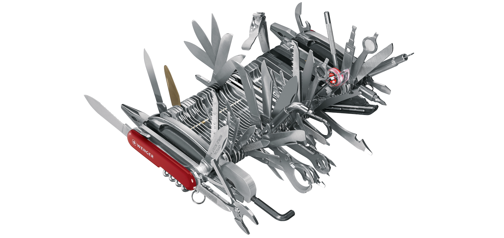
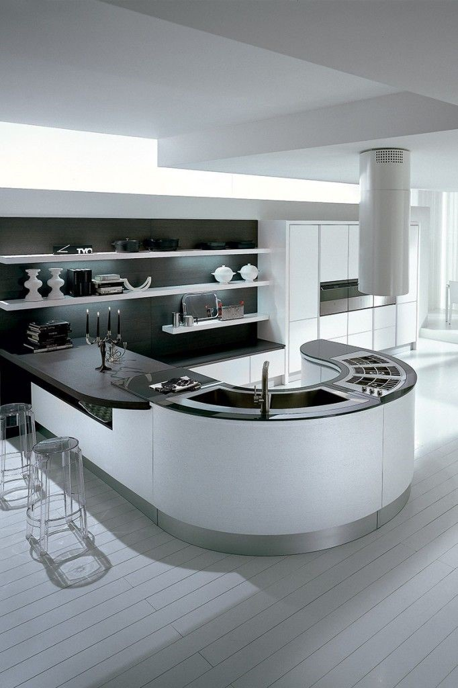

# 🟡 Yellow Belt 🟡 Lesson 5: Emerging Architecture & Simple Design Part I

## 📚 Homework Showcase

- Daily kata awareness moment --> showcase
- 🙋‍♂️ Did you observe the problem as a user?
- 🙋‍♂️ Are your notes now full of examples?
- 🙋‍♂️ Did you use the examples to create the tests?
- 🙋‍♂️ Did the time-lapse picture help you to structure the tests into incremental
  complexity?
- 🙋‍♂️ Did you measure the _accidental complications_ YOU injected in the code? Is
  it ZERO?

---

## 📚 Theory: Emerging Architecture

It starts when the design is to implement a **USER FEATURE**, not an
architectural dream with over/under engineering. The idea behind emerging
architecture in Extreme Programming is to create an architecture that is
flexible, responsive to change, and aligned with the **project's current
needs**. By deferring architectural decisions until necessary and allowing them
to evolve organically, XP aims to reduce the risk of overengineering and to
promote adaptability in the face of changing requirements.

---

## 🏋️ Practice: Emerging Architecture via ATDD

The trainer will deliver the practice via a **RANDORI**.

> In a Randori, you’ll be using a single machine, the trainer's one. Pairs of
> programmers round-rob at the keyboard every 5 minutes or so. The Trainer in
> this scenario will be either driver or navigator based on the class decision.

- Select a kata/game
- Visualize the product as a user
- Describe **examples** of how the kata/game is used
- Create USs and describe the _UAT_ as examples
- Define the `BACKLOG.md` as a composition of incrementally complicated USs
- Let's code and experience the different flavors of emerging architecture

### 0️⃣ - Overengineering (Confusion-Driven Approach)

**Behavior:** _"I code with the fear that my code will break and be buggy. The
fears are driving me crazy. I implement 90% of the features the user NEVER asked
for."_

**Result:** I created the epic and mythological feature bug! A 🇨🇭 Swiss 🔪 knife
on 🦾 _steroids_ that has a tool, _not tested enough_, for everything.

👉 _Accidental complications_ 💥💣🤯

### 1️⃣ - 😱 Poor Engineering (Development Shortcuts)

**Behavior:** _"Coding aimlessly and disinterestedly, I have no awareness or
concern for the task at hand."_

**Result:** Consequently, the banana will inevitably soon fail the test, as it
is destined to disintegrate just after its initial usage.

👉 _Accidental complications_ 😈

### 2️⃣ - 🤔 Brute Force Approach (Discovery via Spikes)

**Behavior:** _"I experimentally do something to make the code work so that I
can understand how to improve it with the next test."_

**Result:** Incrementally, domain awareness and knowledge increase until
defining and building the product right becomes possible.

👉 _Accidental complications_ 📈📉👨🏻‍🔧

### 3️⃣ - 🤩 Ergonomic Design (Clean Architecture + Clean Code)

**Behavior:** _"Doing 'tons' of tests with users to create the **right** product
for the best UX (User Experience)."_

**Result:** Iteratively, the UX tests are creating the best UX for the users,
alongside clean code applied to refactoring by Simple Design and Just-in-Time
Design, which are creating the pillars for an emerging architecture that is easy
to read and maintain as well.

👉 _Accidental complications_ ✅😍

---

## 📚 Homework

1. 5+ katas with notes.
2. Improve your daily drill:
   - Only 1 🍅 Pomodoro
   - Use the 📝 properly
   - Create the time-lapse picture and description
   - 👉 Organize the time-lapse in incremental complexity >> `BACKLOG.md`
   - Commit at every 🔴Red/🟢Green/♻️Refactor
   - After every green scenario, write the technical debt into a file
     `TECHDEBT.md`
   - Commit code, notes, and tech debt in git at every cycle
   - Apply the refactor _Boy Scout rule_
   - 👉 Keep a deeper clean code posture to let the architecture emerge
   - 👉 Check the _accidental complications_. Is it under control and close to
     ZERO?
   - Rate your code as it's a best-seller book... 5⭐️ or 🗑️?
