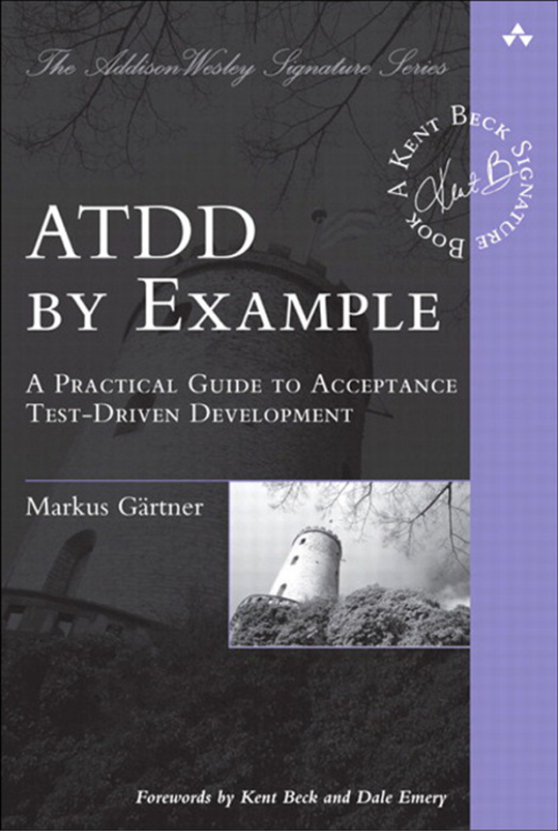

# 🟡 Yellow Belt 🟡 Lesson 7: ATDD & PO gamification

## 📚 Homework Showcase

- Daily kata awareness moment --> showcase
- 🙋‍♂️ Did you observe the problem as a user?
- 🙋‍♂️ Are your notes now full of examples?
- 🙋‍♂️ Did you use the examples to create the tests?
- 🙋‍♂️ Did you measure how emerging architecture impacted _accidental
  complications_?

---

## 👨🏻‍🏫 Recap

- 🤔 What is emerging architecture?
- 🤔 How do we get from a UAT to tests?
- 🤔 Balance between Under-quality vs. over-engineering
  - 🍌 Under-quality
  - 🦾 brute force
  - 🧪 user experience driven
  - 🇨🇭🔪 over-engineering

---

## 📚 Theory - ATDD by Example & Refinement

A small quote from ATDD by Example - Foreword by Kent Beck:

> To read this book you will need to read code. If you follow along, you will
> have the opportunity to learn the shift in thinking that is required to
> succeed with ATDD. That shift is, in short, to quickly go from, ❌ _“Here’s a
> feature I’d like,”_ to 👍 **“How are we going to test that? Here’s an
> example.”**

Welcome to your next read 📖
['ATDD by Example'](https://www.amazon.com/ATDD-Example-Test-Driven-Development-Addison-Wesley/dp/0321784154)
🥳

---

## 🏋️ Practice: RPG - PO Refinement

In this RPG session, the class is gonna face different kinds of product
ownership.

### 🏋️ Practice: 1️⃣ 😮 High-Level Narrative 🗣️

The PO is gonna ask you to expand your yellow belt graduation kata with some new
features. **Only high-level details are provided**. The PO will refuse to
discuss further details, forwarding all the refinement chores on your shoulders.

### 🏋️ Practice: 2️⃣ 😭 Ignoring Tech Debt 😤

The PO is gonna ask you to expand your yellow belt graduation kata with some new
features. **They are way too "heavy" for your current architecture**. The PO
will intentionally challenge you to ignore the technical debt inside your code
base.

### 🏋️ Practice: 3️⃣ 👍 US Refinement Via ATDD 🧑🏻‍🎨

The PO is gonna ask you to expand your yellow belt graduation kata with some new
features. **The PO will refine the features with you expanding them with
examples** about how the users will interact with the game or about how the game
should behave.

---

## 📚 Homework

1. Redo the yellow belt graduation test via ATDD. Be focused on:
   - Only 4 🍅 Pomodori
   - Use the 📝 properly
   - Create the time-lapse picture and description
   - 👉 Organize the time-lapse in incremental complexity >> `BACKLOG.md`
   - 👉 All the USs are with detailed examples like in Practice 3️⃣ 👍 US
     refinement via ATDD 🧑🏻‍🎨
   - 👉 Jumpstarting the test should be a chore of less than 30 sec.
   - Commit at every 🔴Red/🟢Green/♻️Refactor
   - After every green scenario, write the technical debt into a file
     `TECHDEBT.md`
   - Commit code, notes, and tech debt in git at every cycle
   - Apply the refactor _Boy Scout rule_
   - Keep a deeper clean code posture to let the architecture emerge
   - Check the _accidental complications_. Is it under control and close to
     ZERO?
   - Rate your code as it's a best-seller book... 5⭐️ or 🗑️?
