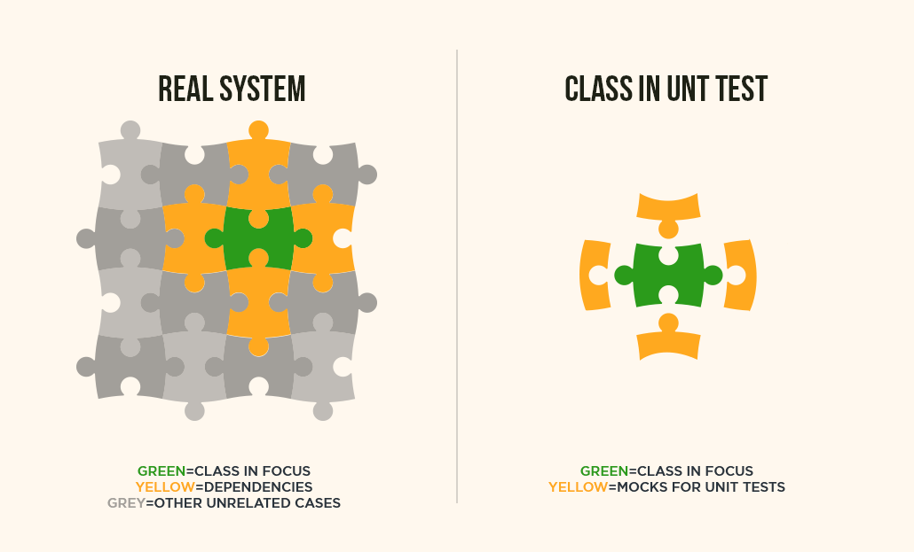
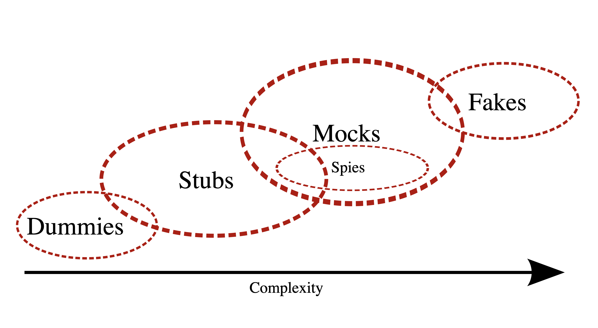

# 🟡 Yellow Belt 🟡 Lesson 8: User-centric CI & mocks

## 📚 Homework Showcase

- Daily kata awareness moment --> showcase of the graduation scenarios via ATDD
- 🙋‍♂️ Did you _finally_ observe the problem as a user?
- 🙋‍♂️ Are your USs with detailed examples in the UAT?
- 🙋‍♂️ Did you create the tests in less than 30 seconds?
- 🙋‍♂️ Did you measure how your code base has different _accidental complications_
  than the graduation's codebase?

---

## 📚 Theory: Test Doubles & Isolation

### 🤔 What Is a Test Touble Used for?

Test doubles improve unit tests by **isolating** the behavior of the code you're
testing from the behavior of the components that the code depends on.

### 🤔 Why Are Test Doubles Usually Called Mocks?

Testing frameworks and libraries have incrementally mutated the term to "mocks"
rather than "test doubles." Mocks are indeed one of the test doubles.

### 📚 Types of Test Doubles

There are five types of test doubles. Solitary unit tests isolate themselves
with mocks. Sociable unit tests try not to:

- 🧪 Solitary tests: 🤷‍♂️ Dummies, 🎭 Stubs, 🕵️‍♀️ Spies, 👮‍♂️ Mocks --> ISOLATION
- 🔌 Socialble tests: 🥸 Fake --> SIMULATION

#### 1️⃣ 🤷‍♂️ Dummies

**Dummies** are test doubles that have _no behavior_; their methods return null
or nothing.

#### 2️⃣ 🎭 Stubs

**Stubs** are test doubles that should have a predefined _behavior we want to
control_. Control that an external API returns a correct response or is down
typical examples of Stubs.

#### 3️⃣ 🕵️‍♀️ Spy Objects

**Spy** objects are _real objects_ with **additional monitoring** capabilities
to observe and record interactions with the dependency while still using its
real implementation. Observing how a command is executed (inputs, #calles,
returned value, etc.) is a typical example of a spy.

> 🧐 FRAGILITY: spies introduce a certain degree of fragility due to coupling
> the tests with the knowledge of how the code under test is implemented.

#### 4️⃣ 👮‍♂️ Mocks Objects

**Mocks** are spies that contain the asserts to _verify_ the correct behaviors
of the component under test.

> 🧐 FRAGILITY: mocks introduce a higher degree of fragility due to strictly
> couple the test with the knowledge of how it MUST BE implemented the code
> under test.

#### 5️⃣ 🥸 Fake Objects

**Fakes** are _simplified implementations_ of dependencies that _mimic the
behavior of real objects_ but _in a simpler and more controlled manner_. For
example, a fake database might use an in-memory data store for testing purposes.
The difference with the other types of test doubles exists in the fact that a
_Fake is not controlled or observed by a test_.

---

## 🏋️ Practice: Refactoring with Doubles

The trainer will deliver the practice via a **RANDORI**

- Step 1️⃣ - 🤷‍♂️ Dummy (e.g., `Null` parameter not important for the test)
- Step 2️⃣ - 🎭 Stub (e.g., static console log string)
- Step 3️⃣ - 🕵️‍♀️ Spy (e.g., spy the script that prints in the console was called)
- Step 4️⃣ - 👮‍♂️ Mock (e.g., verify the script was called and behaved as expected)
- Step 5️⃣ - 🥸 Fake (e.g., a simpler script that mimics the behavior of the real
  one)

---

## 📚 Homework

1. Refactor the yellow belt graduation using 🤷‍♂️ DUMMIES and 🎭 STUBS
2. 5+ katas with notes.
3. Improve your daily drill:
   - Only 1 🍅 Pomodoro
   - Use the 📝 properly
   - Organize the `BACKLOG.md` by ATDD and incremental complexity
   - 👉 Focus to improve your tests using 🤷‍♂️ DUMMIES and 🎭 STUBS
   - Commit at every 🔴Red/🟢Green/♻️Refactor
   - Prioritize the technical debt into `TECHDEBT.md`
   - Apply the refactor _Boy Scout rule_
   - Keep a deeper clean code posture to let the architecture emerge
   - Check the _accidental complications_. Is it under control and close to
     ZERO?
   - Rate your code as it's a best-seller book... 5⭐️ or 🗑️?
