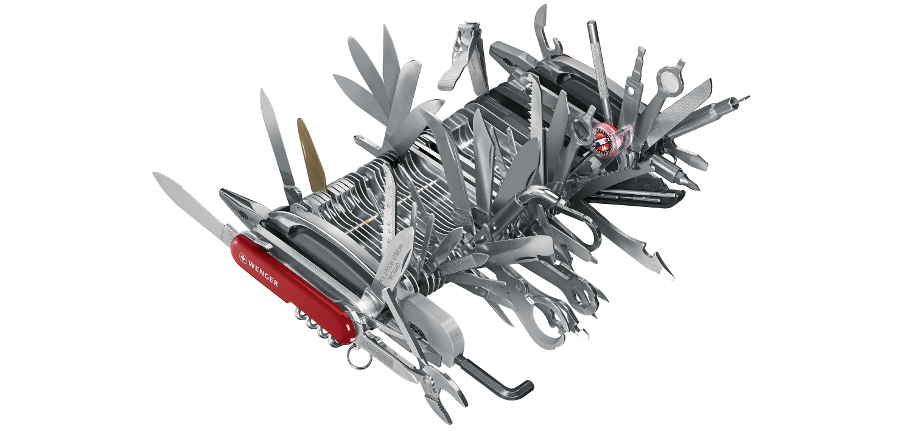

# ⚪️ White Belt ⚪️ Lesson 6: Refactoring & over-engineering

## 📚 Homework showcase

- Daily kata awareness moment --> showcase
- 🙋‍♂️ Did you complete a kata a day?
- 🙋‍♂️ Is your code like well-written prose?

## 👨🏻‍🏫 Recap

- 🤔 What do you think about Refactoring?
- 🤔 Why the code should be readable?

## 🏋️ Practice via RPG: OVER ENGINEER

- The 🇨🇭🔪 anti-pattern:
  - 🪜 Code your kata via small and simple steps
  - 🧘🏻 Focus on the problem
  - 👀 Look at your code
- Is your code over-engineered?
  - The customer is looking for ROI = 🔪
  - How over-engineer looks like = the 🇨🇭🔪 on steroids!

- Overengineer is inside every engineer:
  - [How To Accept Over-Engineering For What It Really Is](https://hackernoon.com/how-to-accept-over-engineering-for-what-it-really-is-6fca9a919263)
  - How do we tame overengineering via proper product ownership?
    - US & UAT --> WORKING SOFTWARE!
    - UAT --> Stay simple and pragmatic (examples)
    - TechDebt --> If the architecture is cranking, it's a sign that the tech
      debt list needs to be reduced to consolidate the SW foundations

## 📚 Homework

1. 5+ katas with notes.
2. Improve your daily drill:
   - Only 1 🍅 Pomodoro
   - Use the 📝 properly
   - Commit at every 🔴Red/🟢Green/♻️Refactor
   - After every green scenario, write the technical debt into a file
     `TECHDEBT.md`
   - Commit code, notes, and tech debt in git at every cycle
   - Read your code 📖 and measure how many WTF moments you're gonna enjoy 😲
   - Rate your code as it's a best-seller book... 5⭐️ or 🗑️?
