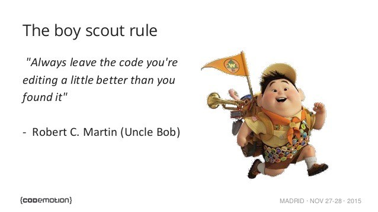

# ⚪️ White Belt ⚪️ Lesson 8: Refactor like a boy scout! Part I

## 📚 Homework showcase

- Daily kata awareness moment --> showcase
- 🙋‍♂️ Did you complete a kata a day?
- 🙋‍♂️ Is your code like well-written prose?
- 🙋‍♂️ Do you collect and tame TechDebt?

## 👨🏻‍🏫 Recap

- 🤔 What do you think about Refactoring?
- 🤔 Why the code should be readable?

## 🏋️ Practice: Hey, kiddo, clean the place before you leave

- The Boy Scout rule of refactoring

- The
  [pyramid of testing (Martin Fowler - 2012)](https://martinfowler.com/bliki/TestPyramid.html)
  vs. being a good Boy Scout!
  - E2E test = 🐢 + 💸
  - Unit test = 🏎️ + 🪙

## 📚 Homework

1. 5+ katas with notes.
2. Improve your daily drill:
   - Only 1 🍅 Pomodoro
   - Use the 📝 properly
   - Commit at every 🔴Red/🟢Green/♻️Refactor
   - After every green scenario, write the technical debt into a file
     `TECHDEBT.md`
   - Commit code, notes, and tech debt in git at every cycle
   - Read your code 📖 and measure how many WTF moments you're gonna enjoy 😲
   - Apply the refactor _Boy Scout rule_
   - Rate your code as it's a best-seller book... 5⭐️ or 🗑️?
